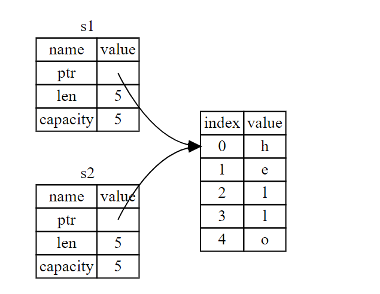

# ownership

## 1. 所有权

程序运行时的栈和堆

所有权的主要目的就是为了管理堆数据。

### 所有权规则：

1. Rust 中的每一个值都有一个 **所有者**（*owner*）。
1. 值在任一时刻有且只有一个所有者。
1. 当所有者（变量）离开作用域，这个值将被丢弃。

### 变量作用域

```rust
#![allow(unused)]
fn main() {
let s = "hello";
}
```

换句话说，这里有两个重要的时间点：

- 当 `s` **进入作用域** 时，它就是有效的。
- 这一直持续到它 **离开作用域** 为止。

### 内存分配

```rust
let s1 = String::from("hello");
let s2 = s1;
```



不过图 4-2 展示了两个数据指针指向了同一位置。这就有了一个问题：当 `s2` 和 `s1` 离开作用域，他们都会尝试释放相同的内存。这是一个叫做 **二次释放**（*double free*）的错误，也是之前提到过的内存安全性 bug 之一。

为了确保内存安全，在 `let s2 = s1;` 之后，Rust 认为 `s1` 不再有效，因此 Rust 不需要在 `s1` 离开作用域后清理任何东西。

因为 Rust 同时使第一个变量无效了，这个操作被称为 **移动**（*move*），而不是叫做浅拷贝。


----

变量的交互可以分为：移动，clone 和 copy

```rust
let x = 5;
let y = x;

println!("x = {}, y = {}", x, y);
```

像整型这样的在编译时已知大小的类型被整个存储在栈上，所以拷贝其实际的值是快速的。这意味着没有理由在创建变量 `y` 后使 `x` 无效。

Rust 有一个叫做 `Copy` trait 的特殊注解，可以用在类似整型这样的存储在栈上的类型上。如果一个类型实现了 `Copy` trait，那么一个旧的变量在将其赋值给其他变量后仍然可用。

Rust 不允许自身或其任何部分实现了 `Drop` trait 的类型使用 `Copy` trait。如果我们对其值离开作用域时需要特殊处理的类型使用 `Copy` 注解，将会出现一个编译时错误。

如下是一些 `Copy` 的类型：

- 所有整数类型，比如 `u32`。
- 布尔类型，`bool`，它的值是 `true` 和 `false`。
- 所有浮点数类型，比如 `f64`。
- 字符类型，`char`。
- 元组，当且仅当其包含的类型也都实现 `Copy` 的时候。比如，`(i32, i32)` 实现了 `Copy`，但 `(i32, String)` 就没有。

## 2. 引用与借用

**引用**（*reference*）像一个指针，因为它是一个地址，我们可以由此访问储存于该地址的属于其他变量的数据。 与指针不同，引用确保指向某个特定类型的有效值。

我们将创建一个引用的行为称为 **借用**（*borrowing*）。

**可变引用**（*mutable reference*）

可变引用有一个很大的限制：如果你有一个对该变量的可变引用，你就不能再创建对该变量的引用。

```rust
let mut s = String::from("hello");

let r1 = &mut s;
let r2 = &mut s;

println!("{}, {}", r1, r2);
```

这一限制以一种非常小心谨慎的方式允许可变性，防止同一时间对同一数据存在多个可变引用。新 Rustacean 们经常难以适应这一点，因为大部分语言中变量任何时候都是可变的。这个限制的好处是 Rust 可以在编译时就避免数据竞争。**数据竞争**（*data race*）类似于竞态条件，它可由这三个行为造成：

- 两个或更多指针同时访问同一数据。
- 至少有一个指针被用来写入数据。
- 没有同步数据访问的机制。

### 悬垂引用（Dangling References）

在具有指针的语言中，很容易通过释放内存时保留指向它的指针而错误地生成一个 **悬垂指针**（*dangling pointer*），所谓悬垂指针是其指向的内存可能已经被分配给其它持有者。

让我们概括一下之前对引用的讨论：

- 在任意给定时间，**要么** 只能有一个可变引用，**要么** 只能有多个不可变引用。
- 引用必须总是有效的。

## 3. Slice

*slice* 允许你引用集合中一段连续的元素序列，而不用引用整个集合。slice 是一类引用，所以它没有所有权。

### 字符串字面量是slice

```rust
let s = "Hello, world!";
```

这里 `s` 的类型是 `&str`：它是一个指向二进制程序特定位置的 slice。这也就是为什么字符串字面值是不可变的；`&str` 是一个不可变引用。

### 字符串slice作为参数

在知道了能够获取字面值和 `String` 的 slice 后，我们对 `first_word` 做了改进，这是它的签名：

```rust
fn first_word(s: &String) -> &str {
```

而更有经验的 Rustacean 会编写出示例 4-9 中的签名，因为它使得可以对 `&String` 值和 `&str` 值使用相同的函数：

```rust
fn first_word(s: &str) -> &str {
```

如果有一个字符串 slice，可以直接传递它。如果有一个 `String`，则可以传递整个 `String` 的 slice 或对 `String` 的引用。

